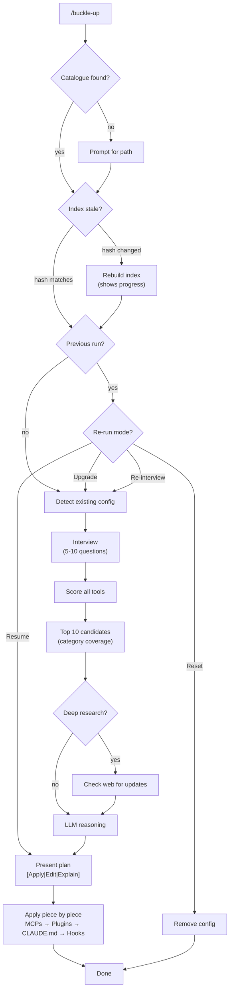

# buckle-up

> Strap in — we're configuring this project properly.

**buckle-up** is a Claude Code plugin that uses your research catalogue to configure the optimal toolset for any project.

## The Problem

You've researched 30+ AI coding tools. Now you're starting a new project and need to pick the right combination. Do you:

A) Spend an hour re-reading all your notes
B) Install everything and mass-produce ~/.claude.json backups
C) Run `/buckle-up` and let it figure it out

## How It Works



**The key steps:**

1. **Index** — Reads your research catalogue, extracts structured data (cached, rebuilds when catalogue changes)
2. **Interview** — Asks 5-10 smart questions about your project
3. **Score** — Ranks every tool against your specific needs
4. **Reason** — Selects the minimal non-overlapping set
5. **Configure** — Sets up MCPs, plugins, hooks, CLAUDE.md

## Prerequisites

A research catalogue with:
- `catalogue.md` — Index of researched tools
- `catalogue/*.md` — Individual research reports

Don't have one? Install [fomo-researcher](https://github.com/razpetel/fomo-researcher) and run `/research` on some tools. Your future self will thank you.

## Installation

```bash
/plugin marketplace add razpetel/buckle-up
/plugin install buckle-up@razpetel
```

Restart Claude Code. (Yes, really.)

## Usage

```bash
# Auto-discover catalogue (checks ./research/ then ~/research-catalogue/)
/buckle-up

# Explicit catalogue path
/buckle-up /path/to/catalogue.md
```

## What Gets Configured

| Component | How |
|-----------|-----|
| **MCPs** | Added to `~/.claude.json` |
| **Plugins** | Installation commands provided |
| **CLAUDE.md** | Methodology references added |
| **Hooks** | Test gates, TDD reminders |

## Re-runs

Changed your mind? Discovered a shiny new tool? Run `/buckle-up` again to:

- **Resume** — Finish interrupted setup
- **Upgrade** — Check for new tools in catalogue
- **Re-interview** — Start fresh with different needs
- **Reset** — Remove all buckle-up configuration

## State

- Configuration saved to `.claude/buckle-up-state.json`
- Backups at `.claude/buckle-up-backup/`
- Index cached at `{catalogue-dir}/.toolshed-index.json`

## How Scoring Works

Each tool is scored across 5 dimensions:

| Dimension | What It Measures |
|-----------|------------------|
| Team fit | Solo vs team, matches your situation |
| Maturity | Production-ready vs beta |
| Complexity | Minimal vs feature-rich, matches your preference |
| Token efficiency | Context usage |
| Autonomy | Human-in-loop vs overnight autonomous |

Weights adjust based on your answers. Bonuses for complementary tools, penalties for conflicts.

## License

MIT

---

*Built because manually configuring Claude Code for every project is not a personality trait.*
