# Buckle-Up Implementation Plan

> **For Claude:** REQUIRED SUB-SKILL: Use superpowers:executing-plans to implement this plan task-by-task.

**Goal:** Build a Claude Code plugin that interviews users, scores tools from a research catalogue, and configures optimal project setup.

**Architecture:** Single skill with supporting reference files. Skill orchestrates the flow; reference files contain prompts, scoring logic, and templates. State persisted to JSON for crash recovery and re-runs.

**Tech Stack:** Markdown skill, Bash hook scripts, JSON state management.

---

## Task 1: SKILL.md Core File

**Files:**
- Create: `skills/buckle-up/SKILL.md`

**Step 1: Write the skill file with frontmatter**

```markdown
---
name: buckle-up
description: Use when starting a new project or optimizing an existing one, when you have a research catalogue and need to configure Claude Code setup (plugins, MCPs, hooks, CLAUDE.md)
---

# Buckle-Up

Configure optimal Claude Code tooling from your research catalogue.

## Overview

Buckle-up interviews you about your project, scores tools from your research catalogue against your needs, and configures the optimal Claude Code setup with your approval.

## Invocation

- `/buckle-up` — Auto-discover catalogue
- `/buckle-up /path/to/catalogue` — Explicit path

## Flow

```dot
digraph buckle_up_flow {
  rankdir=TB;
  node [shape=box];

  start [label="/buckle-up" shape=ellipse];
  find_cat [label="Find catalogue"];
  check_index [label="Index stale?"];
  rebuild [label="Rebuild index\n(show progress)"];
  check_prev [label="Previous run?"];
  rerun_menu [label="Resume|Upgrade|\nRe-interview|Reset"];
  detect_config [label="Detect existing config"];
  interview [label="Interview\n(5-10 questions)"];
  depth [label="Depth questions\n(if ambiguous)"];
  score [label="Score all tools"];
  top10 [label="Top 10 + category\ncoverage"];
  research [label="Deep research?\n[Yes/No]"];
  reason [label="LLM reasoning\n→ minimal set"];
  present [label="Present plan\n[Apply|Edit|Explain]"];
  apply [label="Apply piece by piece\n(MCPs→Plugins→CLAUDE.md→Hooks)"];
  done [label="Done" shape=ellipse];

  start -> find_cat;
  find_cat -> check_index;
  check_index -> rebuild [label="yes"];
  check_index -> check_prev [label="no"];
  rebuild -> check_prev;
  check_prev -> rerun_menu [label="yes"];
  check_prev -> detect_config [label="no"];
  rerun_menu -> detect_config [label="re-interview"];
  rerun_menu -> apply [label="resume"];
  detect_config -> interview;
  interview -> depth;
  depth -> score;
  score -> top10;
  top10 -> research;
  research -> reason;
  reason -> present;
  present -> apply [label="apply"];
  apply -> done;
}
```



## Catalogue Discovery

Check in order:
1. `./research/catalogue.md` (project-local)
2. `~/research-catalogue/catalogue.md` (global default)
3. Prompt user for path

If no catalogue found, offer: [Create with fomo-researcher] | [Point to existing] | [Cancel]

## Interview

Ask 5-10 questions conversationally, one at a time. Save progress after each answer.

See: `references/interview-questions.md`

## Scoring

Score each tool across 5 dimensions with weight multipliers, bonuses, and penalties.

See: `references/scoring-matrix.md`

## Selection

Take top 10 (ensuring category coverage), optionally check web for updates, then use LLM reasoning to select minimal non-overlapping set.

See: `references/tool-categories.md`, `scripts/selection-reasoning.md`

## Apply

Order: MCPs → Plugins → CLAUDE.md → Hooks

Before changes:
1. Snapshot existing config to `.claude/buckle-up-backup/`
2. Confirm each step with user
3. Track applied/pending in `.claude/buckle-up-state.json`

On failure: offer [Retry] | [Skip] | [Rollback]

## Re-runs

Detect previous run via state file. Offer:
- **Resume** — Apply pending items
- **Upgrade** — Re-score with saved answers, show diff
- **Re-interview** — Start fresh
- **Reset** — Remove buckle-up config
- **Status** — Show current configuration

## References

- `references/scoring-matrix.md` — Dimension definitions, weights, formulas
- `references/interview-questions.md` — Question bank with skip logic
- `references/tool-categories.md` — Category definitions and tool mappings
- `scripts/index-catalogue.md` — LLM prompt for indexing
- `scripts/selection-reasoning.md` — LLM prompt for final selection
- `templates/` — CLAUDE.md section, hook scripts
```

**Step 2: Verify file structure**

Run: `ls -la /Users/razpetel/projects/buckle-up/skills/buckle-up/`
Expected: SKILL.md exists

**Step 3: Commit**

```bash
git add skills/buckle-up/SKILL.md
git commit -m "feat: add main SKILL.md for buckle-up"
```

---

## Task 2: Scoring Matrix Reference

**Files:**
- Create: `references/scoring-matrix.md`

**Step 1: Write the scoring matrix reference**

```markdown
# Scoring Matrix

## Dimensions

| Dimension | 0 | 1 | 2 | 3 |
|-----------|---|---|---|---|
| **Team fit** | Wrong size entirely | Usable but not ideal | Good fit | Explicitly built for this |
| **Maturity** | Beta/warnings | Mixed sentiment | Positive, stable | Very Positive, production-proven |
| **Complexity match** | Way over/under | Slight mismatch | Good match | Perfect match |
| **Token efficiency** | Token-heavy | Average | Efficient | 90%+ reduction claims |
| **Autonomy match** | Wrong model entirely | Partial fit | Good fit | Exactly what they want |

## Weight Multipliers

Derived from interview answers:

| Interview Signal | Weight |
|------------------|--------|
| Autonomy score 3 OR "overnight runs" mentioned | Autonomy × 2 |
| Token-conscious score 3 | Token efficiency × 2 |
| Maturity = "production" | Maturity × 1.5 |
| Complexity preference = "minimal" | Complexity × 1.5 (inverted) |

Default weight: 1.0

## Bonuses

| Condition | Bonus |
|-----------|-------|
| Tool supports "maybe" feature user mentioned | +1 |
| Tool complements tool user wants to keep | +1 |
| Tool explicitly recommended for user's project type in report | +1 |

## Penalties

| Condition | Penalty |
|-----------|---------|
| Warning in report (security, stability, etc.) | -1 per warning (max -3) |
| Tool conflicts with tool user wants to keep | -2 |

## Formula

```
base_score = Σ(dimension_score × weight_multiplier)
final_score = base_score + bonuses - penalties
```

## Tiebreaker

1. Sentiment: Very Positive (4) > Positive (3) > Mixed (2) > Concerned (1)
2. Stars (higher wins)

## Index Schema

When indexing a tool, extract:

```json
{
  "slug": "tool-slug",
  "name": "Full Tool Name",
  "category": "orchestration|memory|methodology|browser|debugging|infrastructure|reference",
  "teamFit": ["solo", "small-team", "large-team"],
  "maturity": "very-positive|positive|mixed|concerned",
  "complexity": "minimal|moderate|feature-rich",
  "tokenEfficiency": "efficient|neutral|heavy",
  "autonomy": "autonomous|human-in-loop|manual",
  "keywords": ["keyword1", "keyword2"],
  "bestFor": "one-line description of ideal use case",
  "warnings": ["warning1", "warning2"],
  "stars": 12345,
  "complementsTools": ["tool-a", "tool-b"],
  "overlapsTools": ["tool-c", "tool-d"]
}
```
```

**Step 2: Commit**

```bash
git add references/scoring-matrix.md
git commit -m "feat: add scoring matrix reference"
```

---

## Task 3: Interview Questions Reference

**Files:**
- Create: `references/interview-questions.md`

**Step 1: Write the interview questions reference**

```markdown
# Interview Questions

## Core Questions (Always Ask)

### Q1: Project Type
**Ask:** "What are you building?"

**Options:**
- CLI tool
- Web app
- API service
- Library/package
- Monorepo
- Other: [free text]

**Maps to:** Project type for "bestFor" matching

---

### Q2: Team Size
**Ask:** "Are you working solo or with a team?"

**Options:**
- Solo developer
- Small team (2-5 people)
- Larger team (6+)

**Maps to:** teamFit dimension

---

### Q3: Maturity
**Ask:** "Is this a hobby/learning project or production/professional?"

**Options:**
- Hobby/learning
- Production/professional

**Maps to:** Maturity weight multiplier (production = 1.5×)

---

### Q4: Token Consciousness
**Ask:** "How token-conscious are you? (1 = don't care, 2 = somewhat, 3 = very)"

**Options:** 1, 2, 3

**Maps to:** Token efficiency weight (3 = 2×)

---

### Q5: Autonomy
**Ask:** "How much do you want to stay in the loop? (1 = supervise everything, 2 = check in periodically, 3 = let it run overnight)"

**Options:** 1, 2, 3

**Maps to:** Autonomy dimension and weight (3 = 2×)

---

## Feature Questions (Contextual)

### Q6: Memory
**Ask:** "Do you need memory that persists across sessions?"

**Options:** Yes / No / Maybe

**Skip if:** Project type is "CLI tool" (typically stateless)

**Maps to:** Memory category relevance, "maybe" bonus

---

### Q7: Browser Automation
**Ask:** "Will you need browser automation for testing or scraping?"

**Options:** Yes / No / Maybe

**Skip if:** Project type is "Library/package"

**Maps to:** Browser category relevance, "maybe" bonus

---

### Q8: Complexity Preference
**Ask:** "Do you prefer minimal setup or feature-rich tooling?"

**Options:**
- Minimal (fewer tools, simpler config)
- Balanced
- Feature-rich (more capabilities, more complexity)

**Maps to:** Complexity weight multiplier (minimal = 1.5× inverted)

---

## Open Questions (Optional)

### Q9: Existing Tools
**Ask:** "Any existing tools or MCPs you want to keep?"

**Type:** Free text

**Skip if:** No `.claude/` directory exists (new project)

**Maps to:** Complement bonuses, conflict penalties

---

### Q10: Notes
**Ask:** "Anything else I should know about your project?"

**Type:** Free text

**Always last, always optional**

**Maps to:** Context for LLM reasoning

---

## Depth Questions (If Ambiguous)

Trigger when answers conflict or are unclear:

### Memory Clarification
**Trigger:** Q6 = "Maybe"
**Ask:** "What kind of memory would you use? (e.g., remembering user preferences, cross-session context, learning from past interactions)"

### Autonomy vs Tokens Conflict
**Trigger:** Q5 = 3 AND Q4 = 3
**Ask:** "You want autonomous overnight runs but also care about tokens. Which matters more if you had to choose?"

### Existing Tools Clarification
**Trigger:** Q9 mentions tool that could conflict
**Ask:** "You mentioned [tool]. What do you use it for? (helps me avoid recommending overlapping tools)"

---

## Interview State Schema

Save after each answer to `.claude/buckle-up-state.json`:

```json
{
  "interview": {
    "projectType": "web-app",
    "teamSize": "solo",
    "maturity": "production",
    "tokenConscious": 2,
    "autonomy": 3,
    "memory": "yes",
    "browser": "maybe",
    "complexity": "moderate",
    "keepTools": ["brave-search"],
    "notes": "Building a SaaS dashboard"
  }
}
```
```

**Step 2: Commit**

```bash
git add references/interview-questions.md
git commit -m "feat: add interview questions reference"
```

---

## Task 4: Tool Categories Reference

**Files:**
- Create: `references/tool-categories.md`

**Step 1: Write the tool categories reference**

```markdown
# Tool Categories

## Category Definitions

### Orchestration
**Purpose:** Coordinate AI agent workflows, parallel execution, task management

**Tools:**
- superpowers (obra/superpowers)
- oh-my-claudecode
- ralph
- multiclaude
- Auto-Claude
- cc10x
- Get Shit Done (GSD)
- CodeMachine-CLI

**Relevance:** Always relevant

---

### Memory
**Purpose:** Persist context across sessions, learn from interactions

**Tools:**
- Mem0
- OrchestKit (memory layer component)

**Relevance:** If interview.memory = "yes" or "maybe"

---

### Methodology
**Purpose:** Development practices, prompting techniques, workflows

**Tools:**
- Cole Medin's PIV Loop
- Context Engineering
- HDD (Human-Driven Development)
- Claude 4 Best Practices
- Claude That Learns

**Relevance:** Always relevant (added to CLAUDE.md as references, not installed)

---

### Browser
**Purpose:** Browser automation, web scraping, testing

**Tools:**
- agent-browser

**Relevance:** If interview.browser = "yes" or "maybe"

---

### Debugging/Observability
**Purpose:** Understand what Claude is doing, debug issues

**Tools:**
- claude-trace

**Relevance:** If interview.maturity = "production" OR interview.autonomy >= 2

---

### Infrastructure
**Purpose:** Deployment, hosting, data sync

**Tools:**
- Railway
- SourceSync.ai

**Relevance:** If interview.projectType in ["web-app", "API service"]

---

### Reference
**Purpose:** Comparison guides, educational resources

**Tools:**
- Vector DB Comparison
- Vibe Code Camp Summarizer
- AGENTS.md vs Skills evaluation

**Relevance:** Added to CLAUDE.md as references if topically relevant

---

## Selection Rules

### Top 10 Selection

1. Score all tools using scoring matrix
2. For each RELEVANT category:
   - Take top 2 tools by score
   - If category only has 1 tool, take it
3. Fill remaining slots (up to 10 total) with highest-scoring tools regardless of category
4. Never exceed 10 candidates

### Overlap Handling (in LLM Reasoning Phase)

When two tools in same category both make top 10:
- LLM selects ONE based on better fit to specific user needs
- Document why the other was excluded

### Methodology Special Case

Methodology tools are NEVER installed — they're added to CLAUDE.md as reference links. They don't count toward the "install" limit but do count toward top 10 candidates.
```

**Step 2: Commit**

```bash
git add references/tool-categories.md
git commit -m "feat: add tool categories reference"
```

---

## Task 5: Index Catalogue Prompt

**Files:**
- Create: `scripts/index-catalogue.md`

**Step 1: Write the indexing prompt**

```markdown
# Index Catalogue Prompt

Use this prompt to generate the toolshed index from research reports.

---

## Instructions

You are indexing a research catalogue for the buckle-up tool selection system.

For each tool report, extract structured data that enables scoring against user needs.

## Input

You will receive:
1. The catalogue.md index file (list of all tools with summaries)
2. Individual report files for each tool

## Output Format

Generate a JSON index with this structure:

```json
{
  "version": "1.0",
  "catalogueHash": "<SHA-256 of catalogue.md>",
  "generatedAt": "<ISO timestamp>",
  "tools": [
    {
      "slug": "<url-safe identifier>",
      "name": "<full tool name>",
      "category": "<one of: orchestration|memory|methodology|browser|debugging|infrastructure|reference>",
      "teamFit": ["<solo|small-team|large-team>"],
      "maturity": "<very-positive|positive|mixed|concerned>",
      "complexity": "<minimal|moderate|feature-rich>",
      "tokenEfficiency": "<efficient|neutral|heavy>",
      "autonomy": "<autonomous|human-in-loop|manual>",
      "keywords": ["<searchable terms>"],
      "bestFor": "<one sentence describing ideal use case>",
      "warnings": ["<any cautions from report>"],
      "stars": <github stars as integer>,
      "complementsTools": ["<tools that work well with this>"],
      "overlapsTools": ["<tools with similar functionality>"]
    }
  ]
}
```

## Field Extraction Rules

### slug
- Lowercase, hyphenated version of tool name
- Example: "obra/superpowers" → "superpowers"

### category
Map based on tool's primary function:
- Workflow/agent orchestration → "orchestration"
- Session persistence/memory → "memory"
- Development methodology/practices → "methodology"
- Browser automation → "browser"
- Debugging/logging/observability → "debugging"
- Deployment/hosting/data → "infrastructure"
- Guides/comparisons/educational → "reference"

### teamFit
Extract from report's "best for" or target audience:
- "solo developer" / "individual" → include "solo"
- "small team" / "2-5" / "startup" → include "small-team"
- "enterprise" / "10+" / "large team" → include "large-team"

### maturity
Map from report's sentiment field:
- "Very Positive" → "very-positive"
- "Positive" → "positive"
- "Mixed" → "mixed"
- "Concerned" or warnings about stability → "concerned"

### complexity
Infer from feature count and setup requirements:
- Few features, simple setup → "minimal"
- Moderate features, some config → "moderate"
- Many features, complex setup → "feature-rich"

### tokenEfficiency
Look for explicit mentions:
- "90% reduction" / "token efficient" → "efficient"
- "token heavy" / "context expensive" → "heavy"
- No mention → "neutral"

### autonomy
Based on workflow style:
- "overnight" / "autonomous" / "unattended" → "autonomous"
- "human in loop" / "approval" / "interactive" → "human-in-loop"
- Requires constant interaction → "manual"

### keywords
Extract:
- Technology names (TDD, React, Python)
- Concepts (workflow, memory, parallel)
- Problem domains (debugging, testing, deployment)

### bestFor
One sentence from report summary or recommendation.

### warnings
Any security issues, stability concerns, or "wait for" recommendations.

### stars
GitHub stars as integer. Use 0 if not applicable.

### complementsTools / overlapsTools
Extract from report if mentioned, or infer from category:
- Same category = likely overlaps
- Different category but mentioned together = complements

## Validation

After generating, verify:
- [ ] Every tool has all required fields
- [ ] Category is one of the allowed values
- [ ] Maturity matches sentiment from report
- [ ] No duplicate slugs
```

**Step 2: Commit**

```bash
git add scripts/index-catalogue.md
git commit -m "feat: add index catalogue prompt"
```

---

## Task 6: Selection Reasoning Prompt

**Files:**
- Create: `scripts/selection-reasoning.md`

**Step 1: Write the selection reasoning prompt**

```markdown
# Selection Reasoning Prompt

Use this prompt after scoring to select the minimal optimal toolset.

---

## Context

You are selecting the final toolset for a user's project.

### User Needs (from interview)

{interview_summary}

### Top 10 Candidates (by score)

{scored_tools_table}

### Existing Tools User Wants to Keep

{existing_tools}

---

## Task

Select the **MINIMAL** set of tools that:

1. **Covers all stated needs** — Every user requirement maps to a selected tool
2. **No overlapping functionality** — If two tools do the same thing, pick ONE
3. **Respects complexity preference** — Don't recommend 10 tools to someone who wants minimal setup
4. **Works with existing tools** — No conflicts with what they're keeping

---

## Decision Process

For each tool in top 10, ask:

1. Does this cover a user need that nothing else covers better?
2. Does this overlap with a higher-scoring tool I already selected?
3. Does this conflict with tools the user wants to keep?
4. Is this overkill for their complexity preference?

---

## Output Format

### Selected Tools

For each selected tool:

**[Tool Name]** — [Category]
- **Why selected:** [Cite specific user need this addresses]
- **Unique value:** [What this provides that alternatives don't]

### Methodology References

List methodology reports to add to CLAUDE.md (not installed, just linked):

- **[Report Name]** — [One sentence on why it's relevant]

### Excluded Tools

For each tool from top 10 that was NOT selected:

**[Tool Name]**
- **Why excluded:** [Overlap with X / User said Y / Warning about Z]

### Configuration Summary

```
MCPs to install: [list]
Plugins to install: [list]
Hooks to configure: [list]
CLAUDE.md references: [list]
```

---

## Example Output

### Selected Tools

**superpowers** — Orchestration
- **Why selected:** User wants structured workflows; matches "production" maturity need
- **Unique value:** TDD + brainstorm skills; highest-rated orchestration tool

**Mem0** — Memory
- **Why selected:** User answered "yes" to memory; production-ready
- **Unique value:** Only enterprise-grade memory solution in catalogue

### Methodology References

- **Context Engineering** — User is token-conscious (score 2); provides reduction strategies
- **PIV Loop** — Complements superpowers workflow

### Excluded Tools

**oh-my-claudecode**
- **Why excluded:** Overlaps with superpowers; superpowers scored higher and better fits "human-in-loop" preference

**ralph**
- **Why excluded:** User wants to "stay in the loop" (autonomy=1); ralph is for overnight autonomous runs

### Configuration Summary

```
MCPs to install: brave-search, mem0
Plugins to install: superpowers@obra
Hooks to configure: pre-commit-test-gate
CLAUDE.md references: Context Engineering, PIV Loop, Claude 4 Best Practices
```
```

**Step 2: Commit**

```bash
git add scripts/selection-reasoning.md
git commit -m "feat: add selection reasoning prompt"
```

---

## Task 7: CLAUDE.md Section Template

**Files:**
- Create: `templates/claude-md-section.md`

**Step 1: Write the template**

```markdown
## Buckle-Up Configuration

> Generated: {date}
> Catalogue: {catalogue_path}

### Methodology

{methodology_references}

### Installed Tools

| Tool | Category | Purpose |
|------|----------|---------|
{tools_table}

### Memory

{memory_section}

### Hooks

{hooks_section}

---

*Configured by [buckle-up](https://github.com/razpetel/buckle-up). Run `/buckle-up` to update.*
```

**Step 2: Commit**

```bash
git add templates/claude-md-section.md
git commit -m "feat: add CLAUDE.md section template"
```

---

## Task 8: Hook Scripts

**Files:**
- Create: `templates/hooks/pre-commit-test-gate.sh`
- Create: `templates/hooks/post-edit-tdd-reminder.sh`
- Create: `templates/hooks/stop-session-log.sh`

**Step 1: Write pre-commit-test-gate.sh**

```bash
#!/usr/bin/env bash
# pre-commit-test-gate.sh
# Runs tests before Claude commits code

INPUT="$1"

# Only intercept git commit commands
if ! echo "$INPUT" | grep -q "git commit"; then
  exit 0
fi

echo "🧪 Running tests before commit..."

# Detect and run test suite
if [ -f "package.json" ] && grep -q '"test"' package.json; then
  npm test || { echo "❌ Tests failed. Fix before committing."; exit 1; }
elif [ -f "pyproject.toml" ] || [ -f "pytest.ini" ] || [ -f "setup.py" ]; then
  python -m pytest || { echo "❌ Tests failed. Fix before committing."; exit 1; }
elif [ -f "Cargo.toml" ]; then
  cargo test || { echo "❌ Tests failed. Fix before committing."; exit 1; }
elif [ -f "go.mod" ]; then
  go test ./... || { echo "❌ Tests failed. Fix before committing."; exit 1; }
else
  echo "ℹ️  No test runner detected, skipping pre-commit tests"
fi

exit 0
```

**Step 2: Write post-edit-tdd-reminder.sh**

```bash
#!/usr/bin/env bash
# post-edit-tdd-reminder.sh
# Nudges toward test-first when code is edited

FILE="$1"

# Skip if editing test files
if echo "$FILE" | grep -qE "(test_|_test\.|\.test\.|\.spec\.|__tests__)"; then
  exit 0
fi

# Skip non-code files
if ! echo "$FILE" | grep -qE "\.(ts|tsx|js|jsx|py|go|rs|java|rb|kt|swift|c|cpp|h)$"; then
  exit 0
fi

# Skip if this is a new file (likely implementing after writing test)
if [ ! -f "$FILE" ]; then
  exit 0
fi

echo "📝 Consider: Does this change have test coverage?"
exit 0
```

**Step 3: Write stop-session-log.sh**

```bash
#!/usr/bin/env bash
# stop-session-log.sh
# Logs session info for later review

LOG_FILE=".claude/session-history.log"
mkdir -p "$(dirname "$LOG_FILE")"

{
  echo "---"
  echo "session_end: $(date -Iseconds)"
  echo "directory: $(pwd)"
  echo "git_branch: $(git branch --show-current 2>/dev/null || echo 'n/a')"
  echo "git_status: $(git status --porcelain 2>/dev/null | wc -l | tr -d ' ') uncommitted files"
  echo ""
} >> "$LOG_FILE"
```

**Step 4: Make scripts executable**

Run: `chmod +x templates/hooks/*.sh`

**Step 5: Verify**

Run: `ls -la templates/hooks/`
Expected: All three .sh files with execute permission

**Step 6: Commit**

```bash
git add templates/hooks/
git commit -m "feat: add hook script templates"
```

---

## Task 9: README.md

**Files:**
- Create: `README.md`

**Step 1: Write the README**

```markdown
# buckle-up

> Strap in — we're configuring this project properly.

**buckle-up** is a Claude Code plugin that uses your research catalogue to configure the optimal toolset for any project.

## The Problem

You've researched 30+ AI coding tools. Now you're starting a new project and need to pick the right combination. Do you:

A) Spend an hour re-reading all your notes
B) Just install everything and hope for the best
C) Run `/buckle-up` and let it figure it out

## How It Works

1. **Index** — Reads your research catalogue, extracts structured data
2. **Interview** — Asks 5-10 smart questions about your project
3. **Score** — Ranks every tool against your specific needs
4. **Reason** — Selects the minimal non-overlapping set
5. **Configure** — Sets up MCPs, plugins, hooks, CLAUDE.md

## Prerequisites

A research catalogue with:
- `catalogue.md` — Index of researched tools
- `catalogue/*.md` — Individual research reports

Don't have one? Install [fomo-researcher](https://github.com/razpetel/fomo-researcher) and run `/research` on some tools.

## Installation

```bash
/plugin marketplace add razpetel/buckle-up
/plugin install buckle-up@razpetel
```

Restart Claude Code.

## Usage

```bash
# Auto-discover catalogue (checks ./research/ then ~/research-catalogue/)
/buckle-up

# Explicit catalogue path
/buckle-up /path/to/catalogue.md
```

## What Gets Configured

| Component | How |
|-----------|-----|
| **MCPs** | Added to `~/.claude.json` |
| **Plugins** | Installation commands provided |
| **CLAUDE.md** | Methodology references added |
| **Hooks** | Test gates, TDD reminders |

## Re-runs

Already configured? Run `/buckle-up` again to:

- **Resume** — Finish interrupted setup
- **Upgrade** — Check for new tools in catalogue
- **Re-interview** — Start fresh with different needs
- **Reset** — Remove all buckle-up configuration

## State

- Configuration saved to `.claude/buckle-up-state.json`
- Backups at `.claude/buckle-up-backup/`
- Index cached at `{catalogue-dir}/.toolshed-index.json`

## How Scoring Works

Each tool is scored across 5 dimensions:

| Dimension | What It Measures |
|-----------|------------------|
| Team fit | Solo vs team, matches your situation |
| Maturity | Production-ready vs beta |
| Complexity | Minimal vs feature-rich, matches your preference |
| Token efficiency | Context usage |
| Autonomy | Human-in-loop vs overnight autonomous |

Weights adjust based on your answers. Bonuses for complementary tools, penalties for conflicts.

## License

MIT

---

*Built because manually configuring Claude Code for every project is not a personality trait.*
```

**Step 2: Commit**

```bash
git add README.md
git commit -m "feat: add README documentation"
```

---

## Task 10: Final Plugin Verification

**Files:**
- Verify: All files in place
- Update: `.claude-plugin/plugin.json` version to 1.0.0

**Step 1: Verify directory structure**

Run:
```bash
find /Users/razpetel/projects/buckle-up -type f -name "*.md" -o -name "*.sh" -o -name "*.json" | grep -v node_modules | sort
```

Expected:
```
.claude-plugin/marketplace.json
.claude-plugin/plugin.json
README.md
docs/plans/2026-02-02-buckle-up-design.md
docs/plans/2026-02-02-buckle-up-implementation.md
references/interview-questions.md
references/scoring-matrix.md
references/tool-categories.md
scripts/index-catalogue.md
scripts/selection-reasoning.md
skills/buckle-up/SKILL.md
templates/claude-md-section.md
templates/hooks/post-edit-tdd-reminder.sh
templates/hooks/pre-commit-test-gate.sh
templates/hooks/stop-session-log.sh
```

**Step 2: Update plugin.json version**

Edit `.claude-plugin/plugin.json`:
```json
{
  "name": "buckle-up",
  "version": "1.0.0",
  ...
}
```

**Step 3: Test local installation**

Run:
```bash
/plugin marketplace add /Users/razpetel/projects/buckle-up
/plugin install buckle-up@buckle-up-dev
```

Restart Claude Code, verify `/buckle-up` skill appears.

**Step 4: Final commit and push**

```bash
git add -A
git commit -m "chore: prepare v1.0.0 release"
git tag v1.0.0
git push origin main
git push origin v1.0.0
```

---

## Summary

| Task | Files | Purpose |
|------|-------|---------|
| 1 | `skills/buckle-up/SKILL.md` | Main skill with flow diagram |
| 2 | `references/scoring-matrix.md` | Dimension definitions, weights |
| 3 | `references/interview-questions.md` | Question bank with skip logic |
| 4 | `references/tool-categories.md` | Category definitions |
| 5 | `scripts/index-catalogue.md` | LLM prompt for indexing |
| 6 | `scripts/selection-reasoning.md` | LLM prompt for selection |
| 7 | `templates/claude-md-section.md` | CLAUDE.md template |
| 8 | `templates/hooks/*.sh` | Three hook scripts |
| 9 | `README.md` | User documentation |
| 10 | Verification | Test and release |
