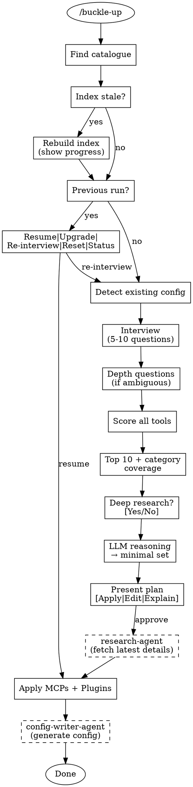

# Buckle-Up

Configure optimal Claude Code tooling from your research catalogue.

## Overview

Buckle-up interviews you about your project, scores tools from your research catalogue against your needs, and configures the optimal Claude Code setup with your approval.

## Invocation

- `/buckle-up` — Auto-discover catalogue
- `/buckle-up /path/to/catalogue` — Explicit path

## Flow

## Catalogue Discovery

Check in order:
1. `./research/catalogue.md` (project-local)
2. `~/research-catalogue/catalogue.md` (global default)
3. Prompt user for path

If no catalogue found, offer: [Create with fomo-researcher] | [Point to existing] | [Cancel]

## Interview

Ask 5-10 questions conversationally, one at a time. Save progress after each answer.

See: `references/interview-questions.md`

## Scoring

Score each tool across 5 dimensions with weight multipliers, bonuses, and penalties.

See: `references/scoring-matrix.md`

## Selection

Take top 10 (ensuring category coverage), optionally check web for updates, then use LLM reasoning to select minimal non-overlapping set.

See: `references/tool-categories.md`, `scripts/selection-reasoning.md`

## Agents

This skill delegates specialized tasks to agents:

### research-agent

**When:** After user approves tool selection, before Apply phase
**Purpose:** Fetch latest versions, install commands, breaking changes for approved tools
**Input:** Approved tools list from state file
**Output:** Updated technical details written to `researchResults` in state

The agent uses WebSearch, GitHub CLI, and context7 to verify:
- Latest version (compare to catalogue)
- Current install command
- Breaking changes since catalogue was written
- Maintenance status (active/deprecated)

See: `agents/research-agent.md`

### config-writer-agent

**When:** During Apply phase, after MCPs and plugins are installed
**Purpose:** Generate optimal CLAUDE.md and hooks using best practices
**Input:** Installed manifest, interview answers, methodology references
**Output:** CLAUDE.md section + hooks configuration

The agent loads best practices from:
- `references/claude-md-guidelines.md`
- Research reports (context-engineering, claude-4-best-practices, everything-claude-code)

Output respects user's token-consciousness and autonomy preferences.

See: `agents/config-writer-agent.md`

## Apply

Order: MCPs → Plugins → **Config Writer** → Verify

### Phase 1: Research (via research-agent)
After user approves the plan, invoke `research-agent` to fetch latest technical details for approved tools. Results written to state file.

### Phase 2: Install MCPs + Plugins
1. **MCPs** — Merge into `~/.claude.json`
2. **Plugins** — Provide installation commands for user to run

### Phase 3: Generate Config (via config-writer-agent)
Invoke `config-writer-agent` with:
- Installed tools manifest
- Interview answers
- Methodology references from catalogue

Agent generates:
- CLAUDE.md section (respects token-consciousness level)
- Hooks configuration (respects autonomy preference)

### Phase 4: Verify
Run checklist from agent output to confirm:
- All tools documented
- Hooks don't conflict
- Word count appropriate

### Safety

Before changes:
1. Snapshot existing config to `.claude/buckle-up-backup/`
2. Confirm each step with user
3. Track applied/pending in `.claude/buckle-up-state.json`

On failure: offer [Retry] | [Skip] | [Rollback]

## Re-runs

Detect previous run via state file. Offer:
- **Resume** — Apply pending items
- **Upgrade** — Re-score with saved answers, show diff
- **Re-interview** — Start fresh
- **Reset** — Remove buckle-up config
- **Status** — Show current configuration

## References

- `references/scoring-matrix.md` — Dimension definitions, weights, formulas
- `references/interview-questions.md` — Question bank with skip logic
- `references/tool-categories.md` — Category definitions and tool mappings
- `references/claude-md-guidelines.md` — Best practices for CLAUDE.md generation
- `scripts/index-catalogue.md` — LLM prompt for indexing
- `scripts/selection-reasoning.md` — LLM prompt for final selection
- `templates/` — CLAUDE.md section, hook scripts
- `agents/research-agent.md` — Fetches latest technical details
- `agents/config-writer-agent.md` — Generates CLAUDE.md and hooks
