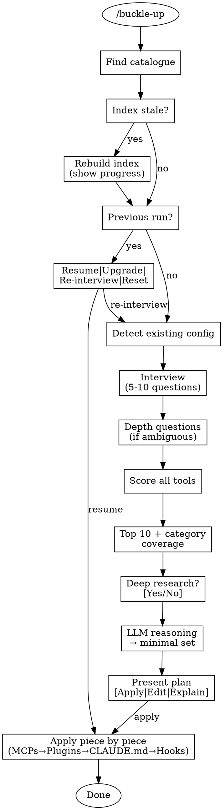

# Buckle-Up

Configure optimal Claude Code tooling from your research catalogue.

## Overview

Buckle-up interviews you about your project, scores tools from your research catalogue against your needs, and configures the optimal Claude Code setup with your approval.

## Invocation

- `/buckle-up` — Auto-discover catalogue
- `/buckle-up /path/to/catalogue` — Explicit path

## Flow

## Catalogue Discovery

Check in order:
1. `./research/catalogue.md` (project-local)
2. `~/research-catalogue/catalogue.md` (global default)
3. Prompt user for path

If no catalogue found, offer: [Create with fomo-researcher] | [Point to existing] | [Cancel]

## Interview

Ask 5-10 questions conversationally, one at a time. Save progress after each answer.

See: `references/interview-questions.md`

## Scoring

Score each tool across 5 dimensions with weight multipliers, bonuses, and penalties.

See: `references/scoring-matrix.md`

## Selection

Take top 10 (ensuring category coverage), optionally check web for updates, then use LLM reasoning to select minimal non-overlapping set.

See: `references/tool-categories.md`, `scripts/selection-reasoning.md`

## Apply

Order: MCPs → Plugins → CLAUDE.md → Hooks

Before changes:
1. Snapshot existing config to `.claude/buckle-up-backup/`
2. Confirm each step with user
3. Track applied/pending in `.claude/buckle-up-state.json`

On failure: offer [Retry] | [Skip] | [Rollback]

## Re-runs

Detect previous run via state file. Offer:
- **Resume** — Apply pending items
- **Upgrade** — Re-score with saved answers, show diff
- **Re-interview** — Start fresh
- **Reset** — Remove buckle-up config
- **Status** — Show current configuration

## References

- `references/scoring-matrix.md` — Dimension definitions, weights, formulas
- `references/interview-questions.md` — Question bank with skip logic
- `references/tool-categories.md` — Category definitions and tool mappings
- `scripts/index-catalogue.md` — LLM prompt for indexing
- `scripts/selection-reasoning.md` — LLM prompt for final selection
- `templates/` — CLAUDE.md section, hook scripts
