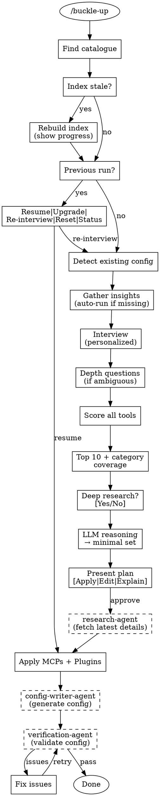

**On skill invocation, read and display the COMPLETE contents of `assets/banner.txt` (all 70 lines including the ASCII art dwarf)**

# Buckle-Up

Configure optimal Claude Code tooling from your research catalogue.

## Overview

Buckle-up interviews you about your project, scores tools from your research catalogue against your needs, and configures the optimal Claude Code setup with your approval.

## Invocation

- `/buckle-up` — Choose catalogue interactively
- `/buckle-up /path/to/catalogue` — Explicit path

## Flow



## Catalogue Discovery

When no path provided with `/buckle-up`, ask user:

**[Use existing catalogue]** — "Enter path to your catalogue.md"
**[Clone readymade catalogue]** — Clone https://github.com/razpetel/research-catalogue to `~/research-catalogue/` and use it
**[Cancel]** — Exit

For the clone option, run:
```bash
git clone https://github.com/razpetel/research-catalogue.git ~/research-catalogue
```
Then continue with `~/research-catalogue/catalogue.md`.

## Insights Integration

Before interviewing, buckle-up gathers usage insights from Claude Code:

1. Check `~/.claude/usage-data/report.html`
2. If missing or stale (>14 days): auto-run `/insights`
   ```bash
   echo "/insights" | claude -p 2>/dev/null
   ```
3. Parse report: project areas, tool usage, autonomy signals, friction points
4. Generate inferences with confidence levels (high/medium/low)
5. Personalize questions — show inferences, let user confirm or override

**Auto-refresh:** Missing or stale reports trigger automatic regeneration.

**Failure fallback:** If `/insights` fails or times out, continue with standard questions.

**Never skip questions:** Insights inform but don't decide. Always ask, but contextualize with inferences when confident.

See: `references/insights-integration.md`

## Interview

Ask 5-10 questions conversationally, one at a time. Save progress after each answer.

See: `references/interview-questions.md`

## Scoring

Score each tool across 5 dimensions with weight multipliers, bonuses, and penalties.

See: `references/scoring-matrix.md`

## Selection

Take top 10 (ensuring category coverage), optionally check web for updates, then use LLM reasoning to select minimal non-overlapping set.

See: `references/tool-categories.md`, `scripts/selection-reasoning.md`

## Agents

This skill delegates specialized tasks to agents defined at the plugin level (in the `agents/` directory at the plugin root):

### research-agent

**When:** After user approves tool selection, before Apply phase
**Purpose:** Fetch latest versions, install commands, breaking changes for approved tools
**Input:** Approved tools list from state file
**Output:** Updated technical details written to `researchResults` in state

The agent uses WebSearch, GitHub CLI, and context7 to verify:
- Latest version (compare to catalogue)
- Current install command
- Breaking changes since catalogue was written
- Maintenance status (active/deprecated)

See: `agents/research-agent.md`

### config-writer-agent

**When:** During Apply phase, after MCPs and plugins are installed
**Purpose:** Generate optimal CLAUDE.md and hooks using best practices
**Input:** Installed manifest, interview answers, methodology references
**Output:** CLAUDE.md section + hooks configuration

The agent loads best practices from `references/guidance.md` — a comprehensive 1500+ line reference synthesized from context-engineering, claude-4-best-practices, and everything-claude-code research. No external dependencies required.

Output respects user's token-consciousness and autonomy preferences.

See: `agents/config-writer-agent.md`

### verification-agent

**When:** After config-writer-agent completes, before declaring Done
**Purpose:** Validate configuration is operational, coherent, and matches spec
**Input:** State file, installed config files
**Output:** Verification report with pass/fail status

The agent checks four dimensions:
- Operational: MCPs configured, hooks valid, env vars set
- Coherent: No duplicates, no conflicts, refs match installed
- Well-defined: Valid JSON, complete state, expected sections
- Matches spec: Tools match approved, token budget met, autonomy applied

On issues: offer [Fix issues] | [Continue anyway] | [Rollback]

See: `agents/verification-agent.md`, `references/verification-rules.md`

## Apply

Order: MCPs → Plugins → **Config Writer** → Verify

### Phase 1: Research (via research-agent)
After user approves the plan, invoke `research-agent` to fetch latest technical details for approved tools. Results written to state file.

### Phase 2: Install MCPs + Plugins
1. **MCPs** — Merge into `~/.claude.json`
2. **Plugins** — Provide installation commands for user to run

### Phase 3: Generate Config (via config-writer-agent)
Invoke `config-writer-agent` with:
- Installed tools manifest
- Interview answers
- Methodology references from catalogue

Agent generates:
- CLAUDE.md section (respects token-consciousness level)
- Hooks configuration (respects autonomy preference)

### Phase 4: Verify (via verification-agent)
Invoke `verification-agent` to validate four dimensions:
- Operational: MCPs configured, hooks valid, env vars set
- Coherent: No duplicates, no conflicts, refs match installed
- Well-defined: Valid JSON, complete state
- Matches spec: Token budget, autonomy alignment

On issues: offer [Fix] | [Continue anyway] | [Rollback]

### Safety

Before changes:
1. Snapshot existing config to `.claude/buckle-up-backup/`
2. Confirm each step with user
3. Track applied/pending in `.claude/buckle-up-state.json`

On failure: offer [Retry] | [Skip] | [Rollback]

## Re-runs

Detect previous run via state file. Offer:
- **Resume** — Apply pending items
- **Upgrade** — Re-score with saved answers, show diff
- **Re-interview** — Start fresh
- **Reset** — Remove buckle-up config
- **Status** — Show current configuration

## References

- `references/insights-integration.md` — Extraction schema, inference mapping, personalized patterns
- `references/scoring-matrix.md` — Dimension definitions, weights, formulas
- `references/interview-questions.md` — Question bank with skip logic and personalized variants
- `references/tool-categories.md` — Category definitions and tool mappings
- `references/guidance.md` — Comprehensive config-writer reference (token budgets, templates, hooks)
- `scripts/index-catalogue.md` — LLM prompt for indexing
- `scripts/selection-reasoning.md` — LLM prompt for final selection
- `templates/` — CLAUDE.md section, hook scripts
- `agents/research-agent.md` — Fetches latest technical details
- `agents/config-writer-agent.md` — Generates CLAUDE.md and hooks
- `agents/verification-agent.md` — Validates configuration
- `references/verification-rules.md` — Validation rules and severity levels
